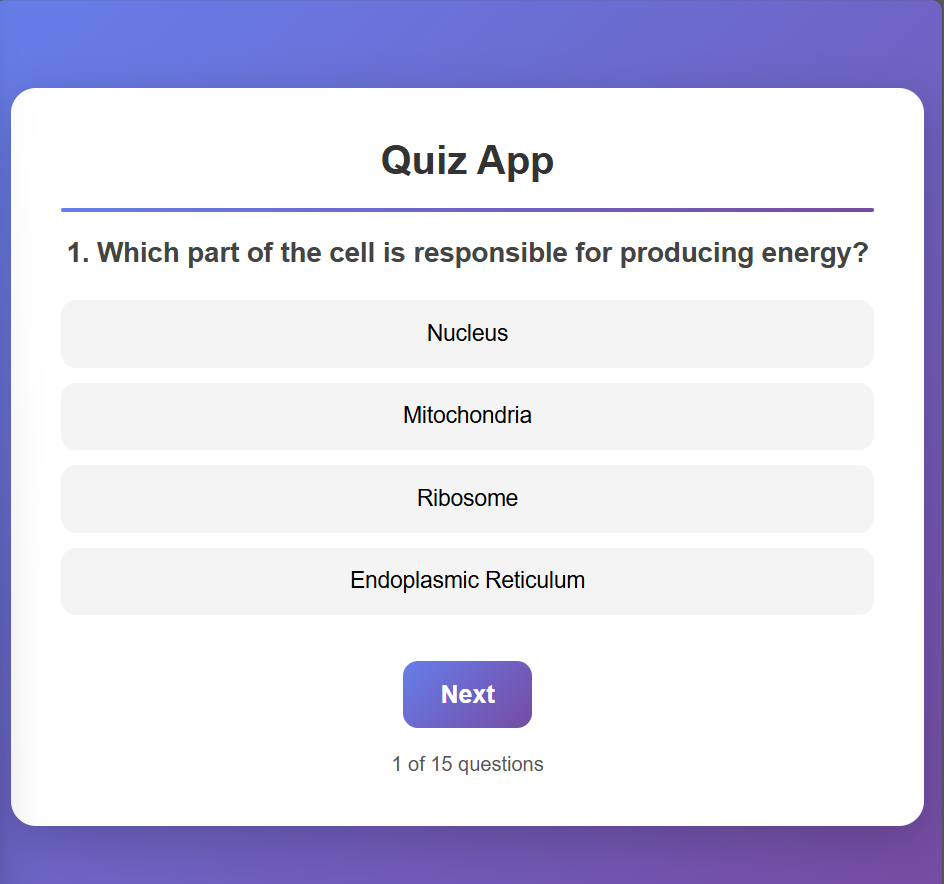
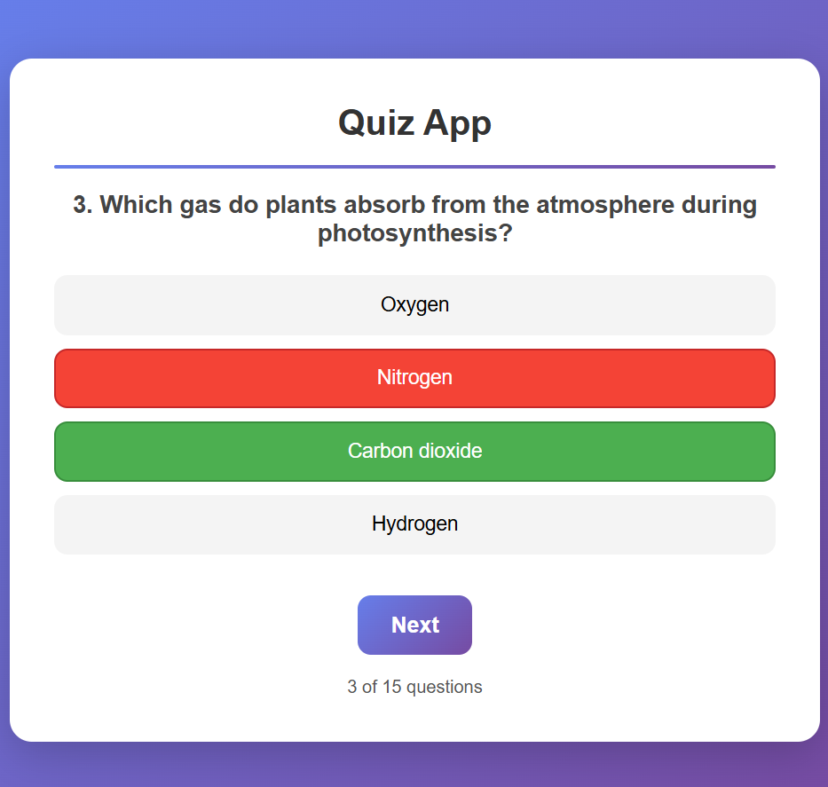
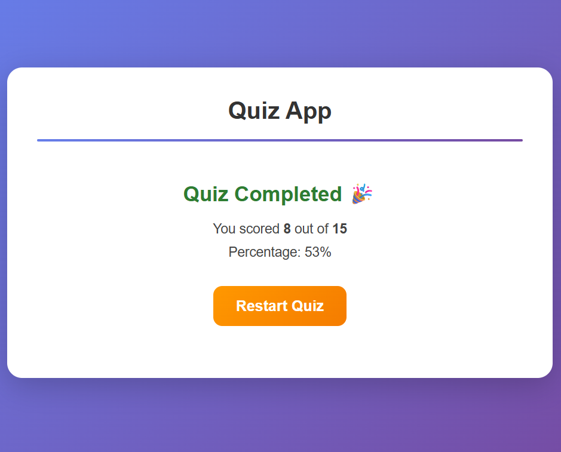

# ✅ Quiz-App

> A modern and interactive quiz application built using **React** and **Vite**, allowing users to test their knowledge with an engaging interface.

---

## 📖 Table of Contents

- [About](#about)
- [Features](#features)
- [Technologies Used](#technologies-used)
- [Usage](#usage)
- [Screenshots](#screenshots)
- [Future Improvements](#future-improvements)
- [Contributors](#contributors)
- [License](#license)

---

## 🧾 About

The **Quiz-App** is a front-end web application developed using **React** and **Vite**.  
It provides a simple platform to create and take quizzes, helping users practice or test their knowledge interactively.

This project is a **learning project** to practice **React components**, **state management**, and **modern front-end development**.

---

## ✨ Features

- Multiple choice quiz interface  
- Dynamic state management using React `useState`  
- Interactive buttons and real-time updates  
- Responsive design for desktop and mobile  
- Hover animations for React and Vite logos  
- Light/Dark mode support via CSS

---

## 💻 Technologies Used

| Category | Technologies |
|-----------|--------------|
| Frontend | React, Vite, HTML, CSS, JavaScript |
| Tools | VS Code, Git, GitHub |
| Assets | SVG logos (React, Vite) |

---

## 🚀 Usage

Open the app in your browser.

Click the React and Vite logos to explore documentation.

Interact with the counter button to test React state.

Customize quiz features by editing src/App.jsx.

---

## 🖼 Screenshots 

## Quiz Interaction

## Result&Counter

---

## 🌟 Future Improvements

Add multiple quiz questions and scoring system

Include user login and progress tracking

Add animations and transitions for quiz results

Make it fully mobile responsive

Add backend integration (Node.js or Firebase)

---

## 👩‍💻 Contributor

**Methni Manarandi** – Developer [GitHub Profile](https://github.com/Methni0616)

---

## 📜 License

This project is open-source and available under the MIT License.

